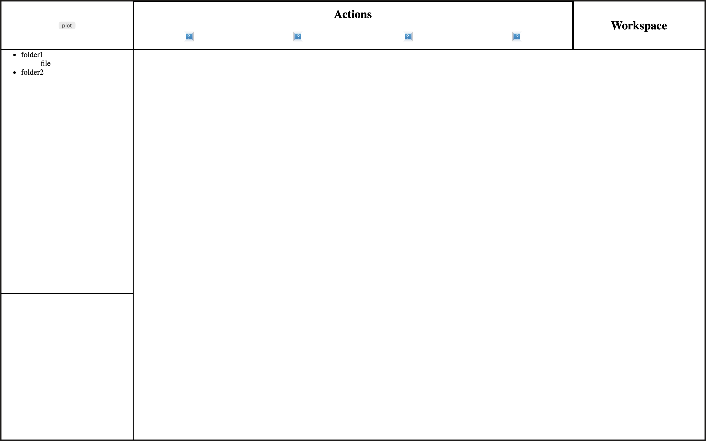

# Parametrox
A basic CAD program, currently capable of solving basic geometric constraint problems.

to see how this program works internally and was created, please look at the architecture.md file 

---
### Installing and Running
To install, first make sure you have both the [Rust](https://rust-lang.org/tools/install/) and [TypeScript](https://www.typescriptlang.org/download/) compilers installed alongside [Git](https://git-scm.com/install/). 
Once you have done that, Open up a terminal and run the following commands:
```
git clone https://github.com/HashDankHog/Parametrox.git
cd Parametrox
cargo install tauri-cli
cargo tauri dev
```
This will open up the program. To rerun the program run `cargo tauri dev` in the root folder of the repository.
### Using Parametrox
Once you have booted up the software, you will see a UI that looks something like this: 

 

<p>To add a point, hover over the right most question mark and click on the button that appears. this will cause a dialouge window
to appear for you to fill out. once you have done that, you can then use the other three buttons to create constraints for all 
of the points. Once you feel happy with said constraints. you can hit the plot button to draw the constrained drawing to the screen.</p>

---

